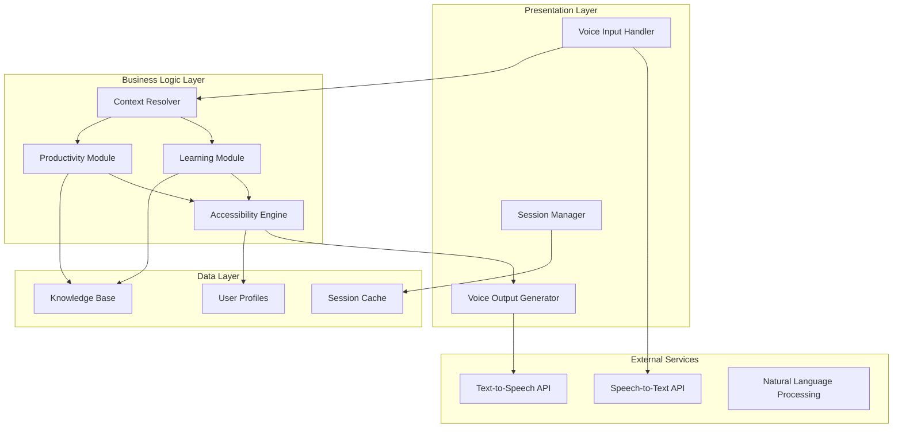

# Design Document: Voice4Bharat AI Learning Assistant

## Overview

Voice4Bharat AI is a voice-first learning and productivity assistant designed to make complex topics accessible through natural speech interaction. The system employs a modular architecture with specialized components for voice processing, content delivery, accessibility adaptation, and knowledge management.

The core design philosophy centers on three principles:
1. **Voice-First Experience**: All interactions are optimized for audio input/output
2. **Adaptive Complexity**: Content automatically adjusts to user comprehension levels
3. **Inclusive Accessibility**: Supports users across literacy and technical skill spectrums

## Architecture

The system follows a layered architecture with clear separation between voice processing, business logic, and data management:



## Components and Interfaces

### Voice Input Handler
**Responsibility**: Captures and preprocesses audio input from users

**Key Methods**:
- `captureAudio()`: Records user speech with noise filtering
- `validateAudioQuality()`: Ensures input meets processing requirements
- `requestClarification()`: Prompts user when input is unclear

**Interfaces**:
- Input: Raw audio stream
- Output: Processed audio ready for speech recognition

### Voice Output Generator
**Responsibility**: Converts text responses to natural speech output

**Key Methods**:
- `generateSpeech(text, userProfile)`: Creates audio with appropriate pacing and tone
- `adjustSpeakingRate(rate)`: Modifies speech speed based on user needs
- `addEmphasisAndPauses(text)`: Enhances clarity through prosodic features

**Interfaces**:
- Input: Structured text with metadata (emphasis, pauses)
- Output: Audio stream for playback

### Learning Module
**Responsibility**: Delivers educational content with step-by-step explanations

**Key Methods**:
- `explainConcept(topic, userLevel)`: Breaks down complex topics
- `generateAnalogy(concept, userContext)`: Creates relatable comparisons
- `adaptExplanation(feedback)`: Modifies approach based on user understanding

**Interfaces**:
- Input: Topic request, user comprehension level, context
- Output: Structured explanation with learning steps

### Productivity Module
**Responsibility**: Provides workflow guidance and tool assistance

**Key Methods**:
- `guideWorkflow(process, userGoal)`: Delivers step-by-step process instructions
- `troubleshootIssue(problem, context)`: Offers problem-solving guidance
- `summarizeDocumentation(source, focus)`: Extracts key information

**Interfaces**:
- Input: Workflow request, problem description, documentation
- Output: Actionable guidance and instructions

### Accessibility Engine
**Responsibility**: Adapts content complexity and delivery for diverse user needs

**Key Methods**:
- `assessUserLevel(interaction)`: Determines appropriate complexity level
- `simplifyLanguage(content, targetLevel)`: Reduces jargon and complexity
- `localizeContent(content, culturalContext)`: Adapts examples and references

**Interfaces**:
- Input: Raw content, user profile, cultural context
- Output: Adapted content appropriate for user level

### Context Resolver
**Responsibility**: Maintains conversation context and routes requests appropriately

**Key Methods**:
- `parseIntent(userInput, sessionContext)`: Determines user's goal
- `maintainContext(newInput, previousContext)`: Updates conversation state
- `routeRequest(intent, context)`: Directs to appropriate module

**Interfaces**:
- Input: User speech (text), session history
- Output: Intent classification, updated context, routing decision

## Data Models

### User Profile
```typescript
interface UserProfile {
  id: string;
  preferredLanguage: string;
  comprehensionLevel: 'beginner' | 'intermediate' | 'advanced';
  literacyLevel: 'illiterate' | 'basic' | 'fluent';
  culturalContext: string;
  learningPreferences: {
    pace: 'slow' | 'normal' | 'fast';
    repetitionNeeds: boolean;
    analogyPreference: boolean;
  };
  interactionHistory: InteractionRecord[];
}
```

### Session Context
```typescript
interface SessionContext {
  sessionId: string;
  userId: string;
  startTime: Date;
  currentTopic: string;
  conversationHistory: Message[];
  userState: {
    comprehensionLevel: number;
    engagementLevel: number;
    confusionIndicators: string[];
  };
  activeModule: 'learning' | 'productivity';
}
```

### Knowledge Entry
```typescript
interface KnowledgeEntry {
  id: string;
  topic: string;
  category: 'technical' | 'general' | 'workflow';
  difficultyLevel: number;
  content: {
    explanation: string;
    steps: Step[];
    analogies: Analogy[];
    examples: Example[];
  };
  metadata: {
    lastUpdated: Date;
    accuracy: number;
    userFeedback: FeedbackRecord[];
  };
}
```

### Explanation Request
```typescript
interface ExplanationRequest {
  topic: string;
  context: string;
  userLevel: string;
  preferredStyle: 'step-by-step' | 'overview' | 'practical';
  timeConstraint?: number;
}
```

### Response Structure
```typescript
interface VoiceResponse {
  content: string;
  metadata: {
    speakingRate: number;
    emphasis: EmphasisMarker[];
    pauses: PauseMarker[];
  };
  followUpSuggestions: string[];
  contextUpdate: Partial<SessionContext>;
}
```

## Correctness Properties

*A property is a characteristic or behavior that should hold true across all valid executions of a system—essentially, a formal statement about what the system should do. Properties serve as the bridge between human-readable specifications and machine-verifiable correctness guarantees.*

### Property 1: Audio Input Processing
*For any* audio input from users, the system should successfully capture, process, and either convert to text or request clarification when quality is insufficient
**Validates: Requirements 1.1, 1.3, 1.4**

### Property 2: Language Detection and Processing
*For any* supported language input, the system should correctly identify the language and process the content appropriately
**Validates: Requirements 1.2, 1.5**

### Property 3: Step-by-Step Content Delivery
*For any* explanation or workflow request, the system should provide responses structured as sequential, digestible steps
**Validates: Requirements 2.1, 3.1**

### Property 4: Complexity-Appropriate Language
*For any* user with a defined comprehension level, all system responses should use language complexity appropriate to that level, avoiding jargon for low-technical users
**Validates: Requirements 2.2, 4.2, 4.3**

### Property 5: Context Preservation
*For any* follow-up question or topic reference within a session, the system should maintain relevant conversation context and provide coherent responses
**Validates: Requirements 2.3, 6.2, 6.4**

### Property 6: Technical Content Enhancement
*For any* technical concept explanation, the response should include analogies, examples, or practical usage information to aid understanding
**Validates: Requirements 2.4, 3.2**

### Property 7: Adaptive Response Generation
*For any* user indication of confusion or request for alternative explanation, the system should provide rephrased content using different approaches
**Validates: Requirements 2.5, 4.4**

### Property 8: Solution Ranking and Presentation
*For any* problem with multiple solutions, the system should present options ranked by simplicity and effectiveness
**Validates: Requirements 3.4**

### Property 9: Accessibility Compliance
*For any* user marked as illiterate, all system interactions should rely entirely on voice without visual dependencies
**Validates: Requirements 4.1**

### Property 10: Cultural Context Adaptation
*For any* user with defined cultural context, explanations should include locally appropriate examples and references
**Validates: Requirements 4.5**

### Property 11: Knowledge Organization
*For any* new information added to the system, it should be properly categorized by topic, difficulty level, and user type
**Validates: Requirements 5.1**

### Property 12: Content Relevance Ranking
*For any* information retrieval request, results should be ordered by relevance and recency
**Validates: Requirements 5.2**

### Property 13: Content Lifecycle Management
*For any* knowledge entry that becomes outdated based on age or accuracy metrics, it should be flagged for review
**Validates: Requirements 5.3**

### Property 14: Feedback Integration
*For any* user feedback provided, the system should update content quality metrics and incorporate improvements
**Validates: Requirements 5.4**

### Property 15: Multi-Source Synthesis
*For any* topic with multiple information sources, the system should synthesize them into coherent, unified explanations
**Validates: Requirements 5.5**

### Property 16: Session Initialization
*For any* new user session, the system should initialize proper context tracking structures
**Validates: Requirements 6.1**

### Property 17: Session Recovery
*For any* interrupted session, the system should offer to resume from the last discussed topic with preserved context
**Validates: Requirements 6.3**

### Property 18: Session Summary Generation
*For any* session end request, the system should provide appropriate summaries of key learning points
**Validates: Requirements 6.5**

### Property 19: Natural Speech Generation
*For any* response generated, the output should include natural conversational patterns with appropriate pacing metadata
**Validates: Requirements 7.1, 7.2**

### Property 20: Prosodic Enhancement
*For any* complex information delivery, the response should include pause and emphasis markers for clarity
**Validates: Requirements 7.3**

### Property 21: Speech Rate Adaptation
*For any* user request to adjust speaking rate, the system should modify speech parameters accordingly
**Validates: Requirements 7.4**

### Property 22: Regional Speech Adaptation
*For any* user with regional preferences, speech output should adapt pronunciation and intonation parameters
**Validates: Requirements 7.5**

### Property 23: Comprehensive Error Handling
*For any* unclear request, technical error, or capability boundary exceeded, the system should provide user-friendly explanations and suggest alternatives
**Validates: Requirements 8.1, 8.2, 8.3, 8.5**

### Property 24: User Guidance for Malformed Requests
*For any* incorrectly formulated user request, the system should provide helpful guidance toward correct formulations
**Validates: Requirements 8.4**

## Error Handling

The system implements a multi-layered error handling approach:

### Input Processing Errors
- **Audio Quality Issues**: Automatic noise filtering with fallback to clarification requests
- **Speech Recognition Failures**: Confidence scoring with graceful degradation to guided input
- **Language Detection Errors**: Default language fallback with user confirmation

### Content Delivery Errors
- **Knowledge Gaps**: Acknowledgment of limitations with related topic suggestions
- **Complexity Mismatches**: Automatic simplification with user feedback integration
- **Context Loss**: Session recovery mechanisms with conversation history reconstruction

### System Boundary Errors
- **Capability Limitations**: Clear boundary explanations with alternative approach suggestions
- **Resource Constraints**: Graceful degradation with priority-based content delivery
- **External Service Failures**: Fallback mechanisms with offline capability where possible

## Testing Strategy

### Dual Testing Approach
The system requires both unit testing and property-based testing for comprehensive coverage:

**Unit Tests** focus on:
- Specific examples of voice processing scenarios
- Edge cases in language detection and speech recognition
- Integration points between modules
- Error conditions and recovery mechanisms
- Cultural adaptation examples

**Property Tests** focus on:
- Universal properties that hold across all user inputs
- Comprehensive input coverage through randomization
- Correctness properties validation across diverse scenarios
- System behavior consistency under varying conditions

### Property-Based Testing Configuration
- **Minimum 100 iterations** per property test to ensure statistical confidence
- **Test Library**: Use Hypothesis (Python) or fast-check (TypeScript) for property-based testing
- **Tagging Format**: Each property test tagged as **Feature: voice-learning-assistant, Property {number}: {property_text}**
- **Coverage Requirements**: Each correctness property implemented by exactly one property-based test

### Testing Priorities
1. **Voice Processing Pipeline**: Audio capture, speech recognition, response generation
2. **Content Adaptation**: Complexity adjustment, cultural localization, accessibility compliance
3. **Context Management**: Session handling, conversation continuity, topic transitions
4. **Error Recovery**: Graceful failure handling, user guidance, system boundary management
5. **Knowledge Management**: Content organization, retrieval accuracy, feedback integration